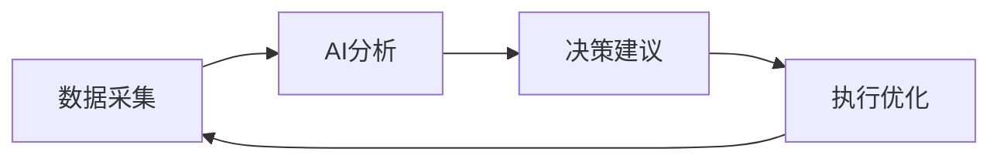
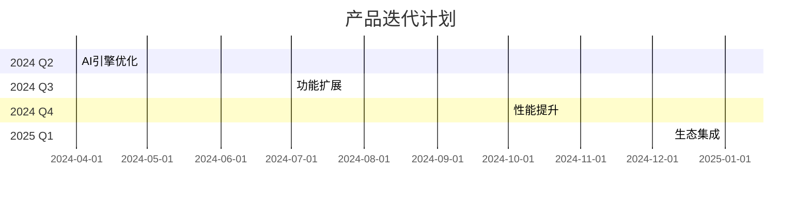

# AI Airdrop Assistant: 智能化空投管理工具白皮书
Version 1.0.0

> 革命性的空投管理体验，AI驱动的智能决策助手

![项目Logo]

## 文档信息
- 发布日期：2024年3月
- 文档版本：V1.0.0
- 官方网站：[即将上线]
- 联系邮箱：[即将上线]

## 重要提示

本文档仅用于传达信息之目的，介绍AI Airdrop Assistant工具的功能特性。本工具不提供投资建议，用户在使用过程中应自行承担风险。

---

## 目录

1. [产品概述](#产品概述)
2. [市场痛点](#市场痛点)
3. [核心功能](#核心功能)
4. [技术架构](#技术架构)
5. [安全体系](#安全体系)
6. [产品规划](#产品规划)

---

## 产品概述

AI Airdrop Assistant 是一款革命性的空投管理工具，采用先进的人工智能技术，为用户提供全方位的空投管理解决方案。通过智能化的决策支持和自动化的任务执行，帮助用户高效管理空投资产，降低操作风险。

### 核心优势

1. **智能决策支持**
   - 基于GPT-4的项目分析
   - 多维度风险评估
   - 实时市场洞察

2. **自动化管理**
   - 多账户批量操作
   - 智能任务调度
   - Gas费用优化

3. **安全防护**
   - 本地加密存储
   - 多重安全验证
   - 风险实时预警

## 市场痛点

### 1. 信息获取难
- 项目分散，难以追踪
- 信息更新不及时
- 优质项目难以识别

### 2. 操作效率低
- 重复性工作多
- 多账户管理复杂
- Gas费用浪费严重

### 3. 安全风险高
- 钓鱼网站频发
- 资产管理混乱
- 操作失误频繁

### 4. 决策难度大
- 项目质量难辨
- 风险评估困难
- 收益预测模糊

## 核心功能

### AI空投雷达™
- 全网项目监控
- 智能风险评级
- 收益潜力分析
- 实时预警提醒

### 智能任务系统™
- 多账户批量操作
- 自动任务分发
- Gas费用优化
- 失败任务重试

### 资产管理中心™
- 多链资产统计
- 收益数据分析
- 操作历史记录
- 风险预警提示

## 技术架构

### 1. AI决策引擎

### 2. 安全防护系统
- 本地加密存储
- 多重安全校验
- 异常行为监控
- 防钓鱼保护

### 3. 自动化引擎
- 智能任务调度
- 多链并行处理
- 失败自动重试
- 资源动态优化

## 安全体系

### 数据安全
- 私钥本地加密存储
- 零知识验证
- 军工级加密算法
- 多重备份机制

### 操作安全
- 智能合约审计
- 多重签名验证
- 风险操作确认
- 异常行为拦截

### 资产安全
- 资产分散管理
- 风险限额控制
- 紧急止损机制
- 实时监控预警

## 产品规划

### 2024-2025发展路线

### 功能迭代计划

1. **第一阶段：基础功能完善**
   - AI决策引擎优化
   - 多链支持扩展
   - 界面交互优化

2. **第二阶段：高级功能开发**
   - 智能策略系统
   - 高级数据分析
   - 自动化程度提升

3. **第三阶段：生态集成**
   - 主流钱包集成
   - DeFi协议对接
   - 社区生态拓展

## 技术优势

### 1. 智能决策系统
- GPT-4驱动的项目分析
- 深度学习的风险评估
- 实时市场数据分析
- 智能化决策建议

### 2. 自动化处理
- 智能任务编排
- 多账户并行处理
- 动态资源调度
- 失败任务恢复

### 3. 安全防护
- 多层安全架构
- 实时风险监控
- 智能异常检测
- 应急响应机制

---

## 免责声明

本工具仅提供技术支持，不构成任何投资建议。用户在使用过程中应自行承担风险，遵守所在地区的法律法规。

© 2024 AI Airdrop Assistant. All Rights Reserved. 